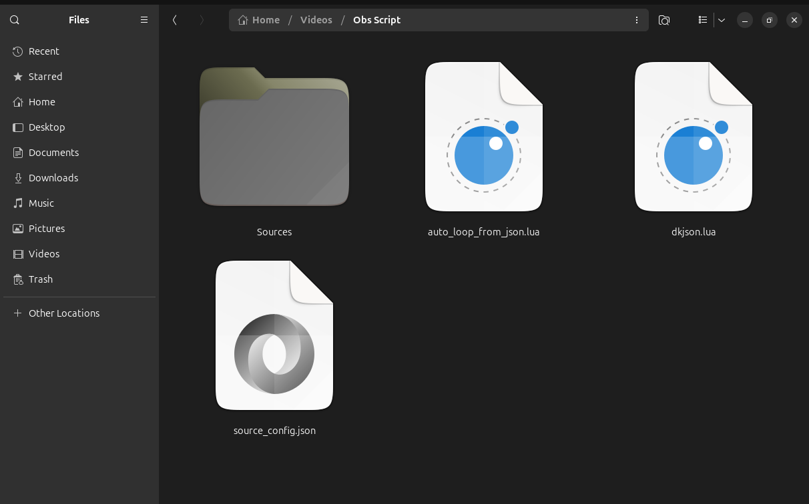
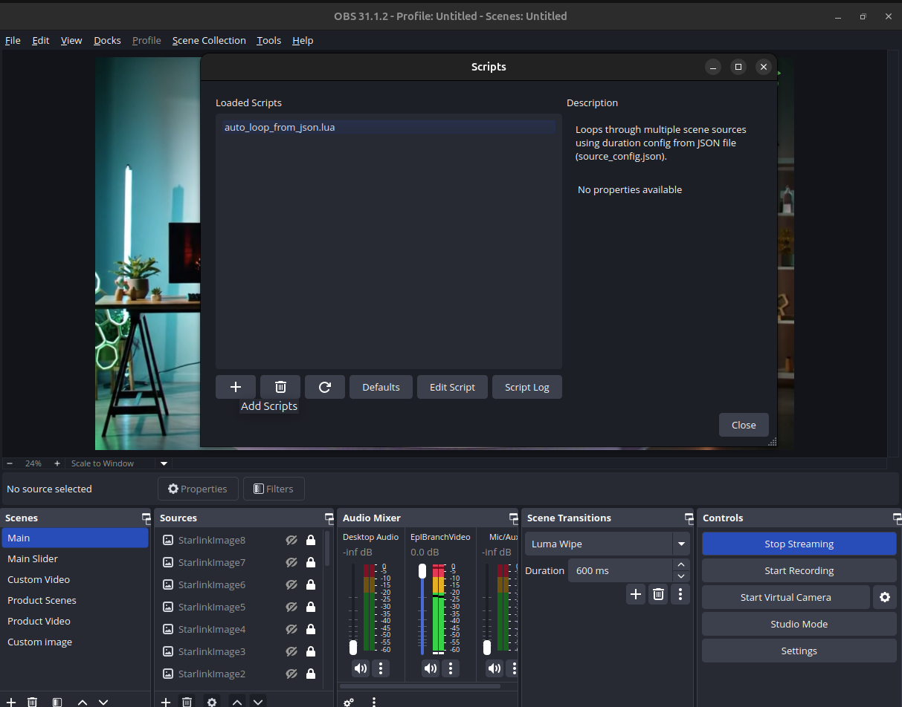
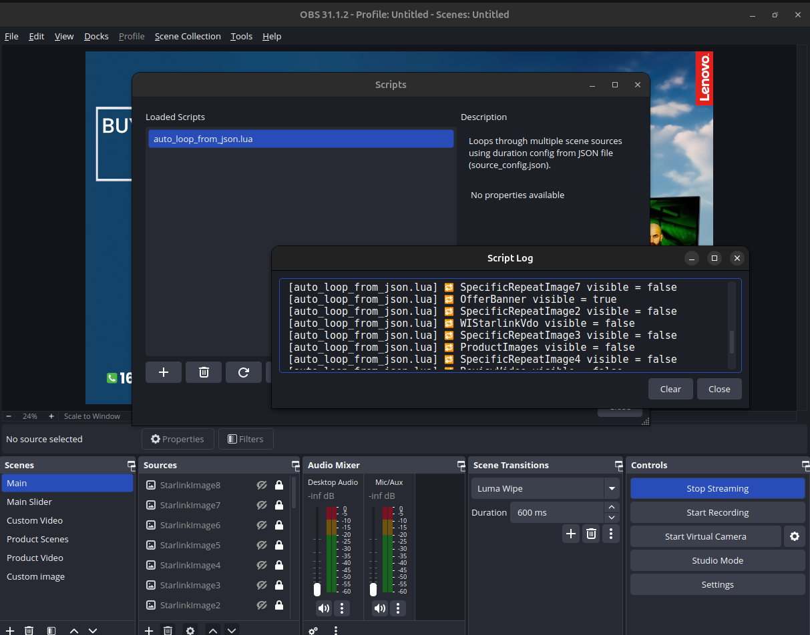

# OBS Source Auto Loop Script

A Lua script for **OBS Studio** that automatically loops through scene sources using a JSON configuration. Perfect for streamers to rotate images, videos, banners, and announcements without manual switching.

---

## ✨ Key Features

- Auto switch between multiple scene sources
- Custom duration for each source (configured via `source_config.json`)
- Loops continuously without manual intervention
- Favorite or repeat sources can be included
- Compatible with OBS Studio on Windows & Mac

---

## 📂 Files in This Repo

- `auto_loop_from_json.lua` – Main Lua script for OBS
- `source_config.json` – JSON config with sources and durations
- `dkjson.lua` – Lua JSON library
- `.gitignore` – Recommended files/folders to ignore
- `LICENSE` – MIT License
- `README.md` – This file

---

## 🛠 Installation

1. **Download or Clone** this repository:

```bash
git clone https://github.com/suvosheikh/OBS-Source-Auto-Loop-Script.git
````

2. Open **OBS Studio**, go to **Tools → Scripts**.
3. Click **+** to add `auto_loop_from_json.lua`.
4. Make sure `dkjson.lua` and `source_config.json` are in the same folder as the Lua script.

---

## ⚙️ Configuration (`source_config.json`)

Example configuration:

```json
[
  { "name": "AnnouncementImage", "duration": 25000},
  { "name": "SpecificRepeatImage0", "duration": 10000},
  { "name": "EplBranchVideo", "duration": 141000},
  { "name": "SpecificRepeatImage7", "duration": 10000},
  { "name": "OfferBanner", "duration": 70000},
  { "name": "SpecificRepeatImage2", "duration": 10000}
]
```

* `name` → Name of the OBS source in your scene
* `duration` → Duration in milliseconds each source will be visible

> You can add or remove sources, and adjust durations as needed.

---

## 📸 Screenshot / Preview
1. **Script & Source in the same folder**  


2. **Add Script on OBS**  


3. **Script successfully worked**  


---

## 📝 Usage

1. Add all sources to your OBS scene.
2. Ensure the names match those in `source_config.json`.
3. Load the Lua script in OBS.
4. Watch your sources auto-switch according to the configured durations.

---

## ⚖️ License

This project is licensed under the [MIT License](LICENSE).

---

## 🔑 Keywords / Tags

`OBS Auto Switch`, `OBS Lua Script`, `OBS Source Loop`, `OBS Streaming Tools`, `OBS JSON Config`, `OBS Automation`

